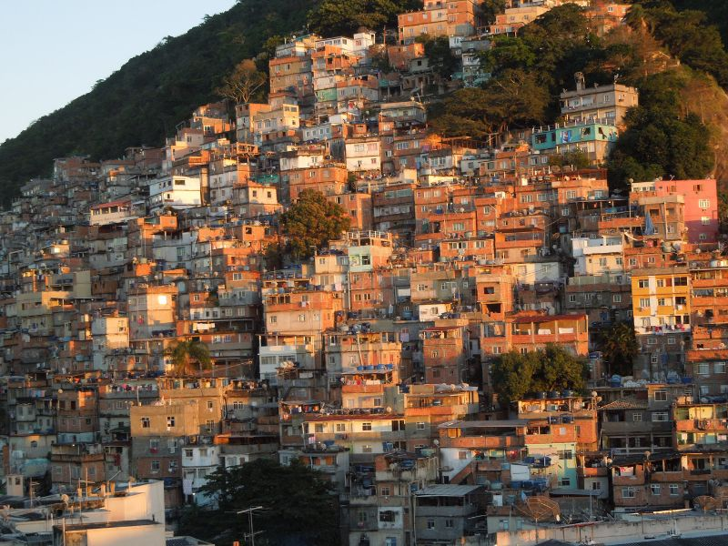
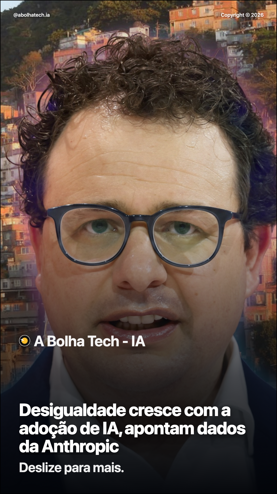

# News Image Generator

Pipeline local para transformar notícias em artes verticais com aparência editorial realista.

## Objetivo

Gerar imagens de notícia com qualidade visual alta, mantendo consistência de marca e evitando o aspecto de “arte de IA genérica”.

Fluxo:
1. Parser (`news.json` / markdown)
2. Copywriter
3. Visual Prompt
4. Geração de imagem (`Google AI`, `Nano Banana` ou `A1111`)
5. Layout final (branding, título, resumo e elementos opcionais de navegação)
6. Validação (opcional)
7. Exportação

## Requisitos

- Python 3.10+
- `pip`
- Playwright + Chromium
- Opcional:
  - `GOOGLE_API_KEY` (Google AI Image)
  - Automatic1111 rodando local
  - endpoint Nano Banana compatível

## Instalação

```bash
python -m venv .venv
source .venv/bin/activate
pip install -e .
python -m playwright install chromium
```

## Formato de entrada

Arquivo: `samples/news.json`

```json
[
  {
    "id": "n1",
    "title": "Título que vai para a imagem final",
    "summary": "Resumo para contexto de geração",
    "sourceUrl": "https://.../foreground.jpg",
    "sourceUrl2": "https://.../background.jpg",
    "journal": "Nome do veículo"
  }
]
```

### Regra visual importante

No modo `--enable-nanobana`:
- `sourceUrl2` sempre é usado como fundo.
- `sourceUrl` sempre é usado como elemento de frente.

Isso ajuda a criar composições com profundidade realista (fundo + assunto em destaque), no estilo editorial.

## Execuções prontas

### 1) Google AI (recomendado)

```bash
source .venv/bin/activate
export GOOGLE_API_KEY="SUA_CHAVE"

news-image-generator run \
  --input samples/news.json \
  --output output_google_real \
  --max-articles 2 \
  --enable-nanobana \
  --enable-google-image-step \
  --google-model gemini-2.5-flash-image \
  --fail-on-fallback \
  --keep-intermediate \
  --json
```

### 2) Automatic1111 (local)

```bash
news-image-generator run \
  --input samples/news.json \
  --output output_a1111 \
  --endpoint http://127.0.0.1:7860 \
  --width 1080 \
  --height 1920 \
  --sampler-name "DPM++ 2M Karras" \
  --second-pass-steps 30 \
  --second-pass-denoise 0.32 \
  --style-preset cinematic \
  --json
```

### 3) Nano Banana endpoint

```bash
news-image-generator run \
  --input samples/news.json \
  --output output_nanobana \
  --enable-nanobana \
  --nanobana-endpoint http://127.0.0.1:9000 \
  --nanobana-style-strength 0.72 \
  --nanobana-identity-lock 0.66 \
  --json
```

### 4) Feed editorial com hint de carrossel opcional

```bash
news-image-generator run \
  --input samples/news.json \
  --output output_editorial \
  --publish-format feed \
  --layout-template editorial \
  --show-swipe-hint
```

## Flags (todas as possibilidades do comando `run`)

```bash
news-image-generator run --help
```

### Entrada/saída
- `--input` caminho para `.json` ou `.md` (obrigatório)
- `--output` pasta de saída (obrigatório)
- `--max-articles` quantidade máxima de notícias
- `--publish-format {story,feed}` define o formato final de publicação
- `--show-swipe-hint` adiciona o texto opcional `Arrasta pro lado` no layout final
- `--json` imprime resumo em JSON

### Dimensão e qualidade de geração
- `--width` largura da geração base
- `--height` altura da geração base
- `--steps` passos do primeiro passe
- `--cfg-scale` guidance scale
- `--seed` seed fixa (`-1` = determinística por item)
- `--sampler-name` sampler do A1111
- `--disable-second-pass` desativa refino de segundo passe
- `--second-pass-steps` passos do segundo passe
- `--second-pass-denoise` denoise do segundo passe
- `--base-pass-scale` escala do primeiro passe
- `--disable-face-restore` desativa face restore
- `--style-preset {cinematic,editorial}` preset de estilo

### Geradores
- `--endpoint` endpoint do A1111
- `--enable-nanobana` ativa o step de referência (foreground/background)
- `--reference-image` fallback de referência (quando faltar `sourceUrl/sourceUrl2`)
- `--nanobana-endpoint` endpoint Nano Banana
- `--nanobana-style-strength` força de estilo
- `--nanobana-identity-lock` trava de identidade
- `--enable-google-image-step` usa Google no step de referência
- `--google-api-key` chave Google (opcional se `GOOGLE_API_KEY` estiver setada)
- `--google-model` modelo Google Image

### Layout/validação/artefatos
- `--font-path` fonte customizada
- `--layout-template {default,editorial}` escolhe entre layout overlay e layout editorial com texto acima da imagem
- `--skip-validator` pula validação
- `--keep-intermediate` mantém `generated/`, `composed/`, `logs/`
- `--fail-on-fallback` falha execução se qualquer item cair em fallback

### Observação sobre dimensões finais

Por padrão:
- `story` -> **1080x1920**
- `feed` -> **1080x1350**

As flags `--width/--height` podem sobrescrever esses valores, mas o ideal é manter o preset do formato de publicação.

## Layout editorial

O template `editorial` foi pensado para posts `feed` com leitura mais limpa:
- topo com handle e copyright
- título em destaque
- resumo opcional acima da imagem
- imagem em card com proporção preservada, sem deformar horizontalmente ou verticalmente
- rodapé com branding
- hint opcional de carrossel com `--show-swipe-hint`

Exemplo:

```bash
news-image-generator run \
  --input samples/news.json \
  --output output_editorial \
  --publish-format feed \
  --layout-template editorial
```

## Exemplo visual completo (input -> output)

### Input (`news.json`) + fontes

Exemplo de item:

```json
{
  "id": "n1",
  "title": "Desigualdade cresce com a adoção de IA, apontam dados da Anthropic",
  "summary": "...",
  "sourceUrl": "https://cdn.arstechnica.net/wp-content/uploads/2025/01/amodei_header_1.jpg",
  "sourceUrl2": "https://originalexperience.com.br/wp-content/uploads/2025/06/Tour-Favela-da-Rocinha-Uma-Imersao-Autentica-na-Comunidade.jpg"
}
```

Fonte de frente (`sourceUrl`):



Fonte de fundo (`sourceUrl2`):


Resultado final gerado:



Esse é o ponto central do projeto: **usar IA sem parecer que é IA**, mantendo composição convincente, profundidade e leitura editorial.

## Saídas

Padrão (limpeza automática):
- `output_x/final/*.png`
- `output_x/final/manifest.json`

Com `--keep-intermediate`:
- `output_x/generated/*.png`
- `output_x/composed/*_thumb.png`
- `output_x/composed/plans/*_plan.json`
- `output_x/logs/image_generator/*.json` ou `output_x/logs/nanobana/*.json`

## Personalização visual atual

Arquivo: `src/news_image_generator/agents/layout_composer_agent.py`

- Handle: `@abolhatech.ia`
- Nome da marca: `A Bolha Tech - IA`
- Avatar: `/Users/adriano/Pictures/channels4_profile.jpg`
- Template `default`: texto sobreposto na imagem
- Template `editorial`: texto acima de um card de imagem
- Texto principal da arte usa `title` do `news.json`
- Resumo da arte usa `summary` quando o template é `editorial`
- Hint opcional de carrossel: `--show-swipe-hint`

## Troubleshooting

### `usedFallbackImages > 0`

Execute com:

```bash
--fail-on-fallback --keep-intermediate
```

E veja logs:
- `output_x/logs/image_generator/*.json`
- `output_x/logs/nanobana/*.json`

### Erro de modelo Google (ex.: 404)

Use um modelo válido, por exemplo:
- `gemini-2.5-flash-image`

### Chave não encontrada

```bash
export GOOGLE_API_KEY="SUA_CHAVE"
```

ou use `--google-api-key`.

### Playwright não renderiza

```bash
python -m playwright install chromium
```

Sem isso, o layout cai no fallback PIL.

## Estrutura

```txt
src/news_image_generator/
  agents/
    parser_agent.py
    copywriter_agent.py
    visual_prompt_agent.py
    image_generator_agent.py
    nanobana_agent.py
    layout_composer_agent.py
    validator_agent.py
    export_agent.py
  pipeline.py
  cli.py
  models.py
```
